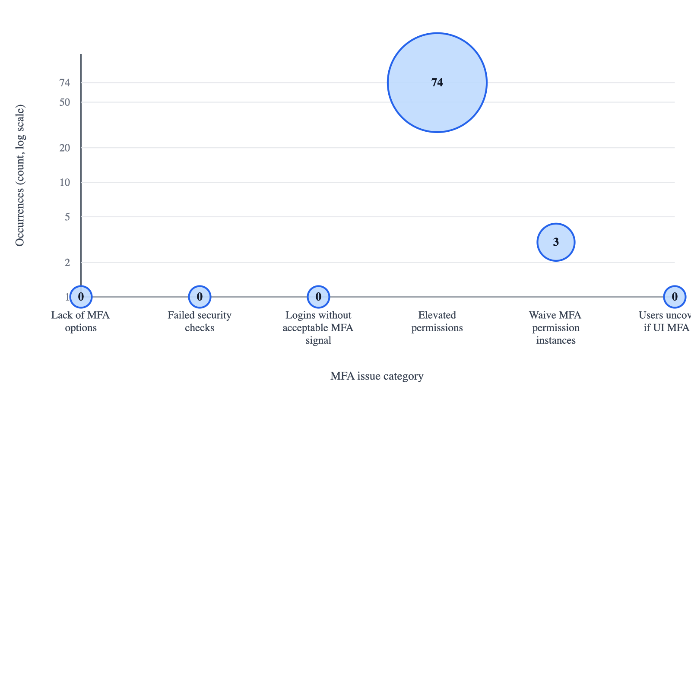

# Salesforce MFA Audit Report
_Run at: 2026-06-30 14:18:06 EDT-0400_

## Executive Summary
> **Overall readiness:** ❌ **Not ready**
> **Section score:** 5/6 passing | ❌ 1 fail

- **Primary takeaway:** 74 privileged internal user(s) must be ready for phishing-resistant MFA, and 3 bypass assignment(s) were detected.
- **Coverage snapshot:** 100 active internal user(s), 0 user(s) with permission-based UI MFA, 0 user(s) not covered if org-wide UI MFA is off.
- **Per-user MFA methods:** visible for 1 internal user(s).
- **SSO snapshot:** 0 SAML config(s) detected.

## Org
- **Alias:** `491`
- **Username:** `rickrice@rickrice-240424-491.demo`
- **Instance:** `https://rickrice-240424-491-demo.my.salesforce.com`

---

## Issue Scatterplot
> **Section score:** 0/1 passing | ⚠️ 1 warning

Point positions use a log-scaled Y-axis so a very large category does not visually flatten the smaller issue categories. Raw counts are still shown inside each point and in the summary below.

- **Lack of MFA options:** 0 occurrence(s) - Disabled built-in authenticator and hardware key options.
- **Failed security checks:** 0 occurrence(s) - Security-focused audit checks currently failing for this org.
- **Logins without acceptable MFA signal:** 0 occurrence(s) - Recent logins classified weak/none/unrecognized/missing (not standard or phishing-resistant) out of 0 sampled logins.
- **Elevated permissions:** 74 occurrence(s) - Privileged internal users in phishing-resistant MFA scope.
- **Waive MFA permission instances:** 3 occurrence(s) - Users with MFA bypass / waiver assignments.
- **Users uncovered if UI MFA off:** 0 occurrence(s) - Internal users without permission-based MFA coverage if org-wide UI MFA is disabled.

---

## Configurations
> **Section score:** 4/4 passing | ℹ️ 2 info

- **Security settings**
  - ✅ Direct UI MFA required: `True`
  - ✅ Built-in authenticator enabled: `True`
  - ✅ Security key / U2F enabled: `True`
  - ℹ️ Lightning Login enabled: `True`
  - ℹ️ SMS identity enabled: `True`
- **Single sign-on settings**
  - ℹ️ SAML login enabled: `False`
  - ℹ️ Multiple SAML configs enabled: `True`
  - ℹ️ Login with Salesforce credentials disabled: `False`
---

## Checks
> **Section score:** 5/6 passing | ❌ 1 fail

- ✅ **PASS**: Require MFA for all direct UI logins [True]
- ✅ **PASS**: Built-in authenticator allowed [True]
- ✅ **PASS**: Physical security key (U2F/WebAuthn) allowed [True]
- ❌ **FAIL**: Users with MFA bypass / waiver assignments detected [3]
- ✅ **PASS**: Privileged users exist and the org allows at least one phishing-resistant MFA method [74]
- ✅ **PASS**: No SAML SSO configuration detected in audited metadata
---

## SSO Signal History
> **Section score:** informational section

- LoginHistory rows sampled: 100
- Rows marked as SSO via `AuthenticationServiceId`: 0
- `AuthMethodReference` field available: `True`
- ACR context reference field available: `False`
- Rows with AMR values: 0
- Rows with phishing-resistant matches: 0
- Rows with standard MFA matches: 0
- Rows with weak/no MFA matches: 0

### Observed AMR Codes
- No AMR codes were returned in the sampled LoginHistory rows.

### Recent Rows With SSO Signal Detail
- No recent LoginHistory rows in the 100-login sample exposed an AMR signal or an SSO-authentication service reference.
---

## Non-SSO Verification History
> **Section score:** 0/1 passing | ⚠️ 1 warning

- VerificationHistory rows sampled: 36
- Non-SSO verification rows retained: 36
- Rows with phishing-resistant methods: 0
- Rows with standard MFA methods: 36
- Rows with weak or recovery methods: 0

### Observed Non-SSO MFA Methods
- ⚠️ `SalesforceAuthenticator` (Salesforce Authenticator) observed 35 time(s) -> Standard MFA
- ⚠️ `Totp` (One-time password) observed 1 time(s) -> Standard MFA

### Recent Non-SSO Verification Rows
- ⚠️ `2026-06-30T18:11:29.000+0000` | Rick <rickrice@rickrice-240424-491.demo> | Browser | Method: `SalesforceAuthenticator` | Label: Salesforce Authenticator | Match: Standard MFA
- ⚠️ `2026-06-30T18:11:12.000+0000` | Rick <rickrice@rickrice-240424-491.demo> | Browser | Method: `SalesforceAuthenticator` | Label: Salesforce Authenticator | Match: Standard MFA
- ⚠️ `2026-06-24T17:42:40.000+0000` | Rick <rickrice@rickrice-240424-491.demo> | Browser | Method: `SalesforceAuthenticator` | Label: Salesforce Authenticator | Match: Standard MFA
- ⚠️ `2026-06-24T17:42:27.000+0000` | Rick <rickrice@rickrice-240424-491.demo> | Browser | Method: `SalesforceAuthenticator` | Label: Salesforce Authenticator | Match: Standard MFA
- ⚠️ `2026-06-23T12:57:41.000+0000` | Rick <rickrice@rickrice-240424-491.demo> | Browser | Method: `SalesforceAuthenticator` | Label: Salesforce Authenticator | Match: Standard MFA
- ⚠️ `2026-06-23T12:57:23.000+0000` | Rick <rickrice@rickrice-240424-491.demo> | Browser | Method: `SalesforceAuthenticator` | Label: Salesforce Authenticator | Match: Standard MFA
- ⚠️ `2026-06-22T13:29:58.000+0000` | Rick <rickrice@rickrice-240424-491.demo> | Browser | Method: `SalesforceAuthenticator` | Label: Salesforce Authenticator | Match: Standard MFA
- ⚠️ `2026-06-22T13:29:46.000+0000` | Rick <rickrice@rickrice-240424-491.demo> | Browser | Method: `SalesforceAuthenticator` | Label: Salesforce Authenticator | Match: Standard MFA
- ⚠️ `2026-06-22T13:11:41.000+0000` | Rick <rickrice@rickrice-240424-491.demo> | Browser | Method: `SalesforceAuthenticator` | Label: Salesforce Authenticator | Match: Standard MFA
- ⚠️ `2026-06-22T13:11:33.000+0000` | Rick <rickrice@rickrice-240424-491.demo> | Browser | Method: `SalesforceAuthenticator` | Label: Salesforce Authenticator | Match: Standard MFA
- ⚠️ `2026-06-22T05:59:58.000+0000` | Rick <rickrice@rickrice-240424-491.demo> | Browser | Method: `SalesforceAuthenticator` | Label: Salesforce Authenticator | Match: Standard MFA
- ⚠️ `2026-06-22T05:59:45.000+0000` | Rick <rickrice@rickrice-240424-491.demo> | Browser | Method: `SalesforceAuthenticator` | Label: Salesforce Authenticator | Match: Standard MFA
- ⚠️ `2026-06-22T05:50:15.000+0000` | Rick <rickrice@rickrice-240424-491.demo> | Browser | Method: `SalesforceAuthenticator` | Label: Salesforce Authenticator | Match: Standard MFA
- ⚠️ `2026-06-22T05:50:03.000+0000` | Rick <rickrice@rickrice-240424-491.demo> | Browser | Method: `SalesforceAuthenticator` | Label: Salesforce Authenticator | Match: Standard MFA
- ⚠️ `2026-06-22T05:32:52.000+0000` | Rick <rickrice@rickrice-240424-491.demo> | Browser | Method: `SalesforceAuthenticator` | Label: Salesforce Authenticator | Match: Standard MFA
- ⚠️ `2026-06-22T05:32:34.000+0000` | Rick <rickrice@rickrice-240424-491.demo> | Browser | Method: `SalesforceAuthenticator` | Label: Salesforce Authenticator | Match: Standard MFA
- ⚠️ `2026-06-22T05:24:24.000+0000` | Rick <rickrice@rickrice-240424-491.demo> | Browser | Method: `SalesforceAuthenticator` | Label: Salesforce Authenticator | Match: Standard MFA
- ⚠️ `2026-06-22T05:24:07.000+0000` | Rick <rickrice@rickrice-240424-491.demo> | Browser | Method: `SalesforceAuthenticator` | Label: Salesforce Authenticator | Match: Standard MFA
- ⚠️ `2026-06-22T05:22:57.000+0000` | Rick <rickrice@rickrice-240424-491.demo> | Browser | Method: `SalesforceAuthenticator` | Label: Salesforce Authenticator | Match: Standard MFA
- ⚠️ `2026-06-22T05:22:40.000+0000` | Rick <rickrice@rickrice-240424-491.demo> | Browser | Method: `SalesforceAuthenticator` | Label: Salesforce Authenticator | Match: Standard MFA
---

## User Summary
> **Section score:** 2/4 passing | ❌ 1 fail | ⚠️ 1 warning

- Active internal users: 100
- Privileged internal users: 74
- Users with bypass assignments: 3
- Users with permission-based UI MFA: 0
- SAML SSO configs: 0
- Users with visible MFA method detail: 1
---

## Users
> **Section score:** 1/3 passing | ❌ 1 fail | ⚠️ 1 warning

### Privileged Users
- **Alan** `<areed.skg5hjwunfl4.193xp2zbyxcd.dnljnsqw1il6@rickrice-240424-491.demo>`
  - Available MFA methods: none visible
  - Profile: System Administrator
  - Profile permission: Modify All Data
  - Profile permission: View All Data
  - Profile permission: Customize Application
  - Profile permission: Author Apex
- **Alf** `<aoperations.ez8ggtk2tpue.jsoqrl1pvo6u.2bqftuncj9ui@rickrice-240424-491.demo>`
  - Available MFA methods: none visible
  - Profile: System Administrator
  - Profile permission: Modify All Data
  - Profile permission: View All Data
  - Profile permission: Customize Application
  - Profile permission: Author Apex
- **Andre** `<amcgee.b4xfzyyrtwn9.euk0rpeuqxli.5k7iy2exr.aj5gb5mp7hgd@rickrice-240424-491.demo>`
  - Available MFA methods: none visible
  - Profile permission: Customize Application
- **Anita** `<agonzale.zysykqqnmut6.luwekbogawlv.6gjkbrp.qhmuest3psfk@rickrice-240424-491.demo>`
  - Available MFA methods: none visible
  - Profile permission: Customize Application
- **App** `<appex.myyf5i5geznx.jzup2mcy7uty.2nskakxnzusb@rickrice-240424-491.demo>`
  - Available MFA methods: none visible
  - Profile: System Administrator
  - Profile permission: Modify All Data
  - Profile permission: View All Data
  - Profile permission: Customize Application
  - Profile permission: Author Apex
- **B2BMA** `<b2bmaintegration@00dam00000een7seaf.ext>`
  - Available MFA methods: none visible
  - Profile permission: View All Data
- **Bill** `<bill.south@rickrice-240424-491.demo>`
  - Available MFA methods: none visible
  - Profile permission: Customize Application
- **Brenda** `<brenda.service@rickrice-240424-491.demo>`
  - Available MFA methods: none visible
  - Profile permission: Customize Application
- **Carrie** `<colson.t3axcg3okv1m.kwoyk21arcbq.ehrrgngjd.ctgwzkj9uye2@rickrice-240424-491.demo>`
  - Available MFA methods: none visible
  - Profile permission: Customize Application
- **Chet** `<chet.callaghan@rickrice-240424-491.demo>`
  - Available MFA methods: none visible
  - Profile permission: Modify All Data
  - Profile permission: View All Data
  - Profile permission: Customize Application
  - Profile permission: Author Apex
- **Chronos** `<chronosbot.yx5maf42qncm.k8a0pysexmoo.kkfxe7tdnnrc@rickrice-240424-491.demo>`
  - Available MFA methods: none visible
  - Profile: System Administrator
  - Profile permission: Modify All Data
  - Profile permission: View All Data
  - Profile permission: Customize Application
  - Profile permission: Author Apex
- **Cindy** `<cindy.central@rickrice-240424-491.demo>`
  - Available MFA methods: none visible
  - Profile permission: Customize Application
- **Connie** `<connie.ruiz.6axwrv39zxub.edudjwhdw3vb.8syvrwhnao3x@rickrice-240424-491.demo>`
  - Available MFA methods: none visible
  - Profile permission: Modify All Data
  - Profile permission: View All Data
  - Profile permission: Customize Application
  - Profile permission: Author Apex
- **David** `<datapipe.hhovxjqteczn.ciowa9fosmqj.goj4erabq3nz@rickrice-240424-491.demo>`
  - Available MFA methods: none visible
  - Profile: System Administrator
  - Profile permission: Modify All Data
  - Profile permission: View All Data
  - Profile permission: Customize Application
  - Profile permission: Author Apex
- **Deanna** `<dmarsh.1ere9zerquct.36v91lbkzzhz.tnkpawa5w.ezqlak5hdrer@rickrice-240424-491.demo>`
  - Available MFA methods: none visible
  - Profile permission: Customize Application
- **Einstein** `<cloud.l4dfmmmyydbn.ykymdldlury9.kfq5oxphwrbf@rickrice-240424-491.demo>`
  - Available MFA methods: none visible
  - Profile: System Administrator
  - Profile permission: Modify All Data
  - Profile permission: View All Data
  - Profile permission: Customize Application
  - Profile permission: Author Apex
- **Einstein** `<ehelp.bqdhql00h7aj.bkguplroeujp.0fcpgngxo4.jaa5yjcrqrgj@rickrice-240424-491.demo>`
  - Available MFA methods: none visible
  - Profile permission: Modify All Data
  - Profile permission: View All Data
  - Profile permission: Customize Application
  - Profile permission: Author Apex
- **Einstein** `<euser.vbuul935nv6q.cz98s8cqxerm.uqgpnvx5sw.rcihurwo5idd@rickrice-240424-491.demo>`
  - Available MFA methods: none visible
  - Profile permission: Modify All Data
  - Profile permission: View All Data
  - Profile permission: Customize Application
  - Profile permission: Author Apex
- **Ely** `<ely.east@rickrice-240424-491.demo>`
  - Available MFA methods: none visible
  - Profile permission: Customize Application
- **Gl1tch** `<gl1tch.vi7n43wtslri.veg1qilyjfg0.9up0rggg826q@rickrice-240424-491.demo>`
  - Available MFA methods: none visible
  - Profile: System Administrator
  - Profile permission: Modify All Data
  - Profile permission: View All Data
  - Profile permission: Customize Application
  - Profile permission: Author Apex
  - Permission set 'Service - Messaging All Permissions': Customize Application
  - Permission set 'Service - LiveText Admin Standard Object Permissions': Customize Application
- **Helen** `<hroberts.ckcye4ywb99m.cchrtopord0r.q3ct1capyqxd@rickrice-240424-491.demo>`
  - Available MFA methods: none visible
  - Profile permission: Modify All Data
  - Profile permission: View All Data
  - Profile permission: Customize Application
  - Profile permission: Author Apex
- **Insights** `<insightsintegration@00dam00000een7seaf.ext>`
  - Available MFA methods: none visible
  - Profile permission: View All Data
- **Integration** `<integration@00dam00000een7seaf.com>`
  - Available MFA methods: none visible
  - Profile permission: View All Data
- **James** `<jharring.cevzuyetmmr9.mszyzld8hkxi.porerdk.6eczlz7a5d0q@rickrice-240424-491.demo>`
  - Available MFA methods: none visible
  - Profile permission: Customize Application
- **James** `<james.5jpgzj1anitv.hpjgdww4u8vk.jsqzlbaljr45@rickrice-240424-491.demo>`
  - Available MFA methods: none visible
  - Profile: System Administrator
  - Profile permission: Modify All Data
  - Profile permission: View All Data
  - Profile permission: Customize Application
  - Profile permission: Author Apex
- **Janet** `<jmartine.b9vaob2ookfg.jh7gesogcdvx.3muwt1i.k0athjpfwx52@rickrice-240424-491.demo>`
  - Available MFA methods: none visible
  - Profile permission: Customize Application
- **Jay** `<jay.service@rickrice-240424-491.demo>`
  - Available MFA methods: none visible
  - Profile permission: Customize Application
- **Kasey** `<kasey.central@rickrice-240424-491.demo>`
  - Available MFA methods: none visible
  - Profile permission: Customize Application
- **Keith** `<kdorsey.ugf7l3mfjncw.d9vhlrhmf4ru.lyrc1eom.zxlfizvcn9by@rickrice-240424-491.demo>`
  - Available MFA methods: none visible
  - Profile permission: Customize Application
- **Linda** `<linda.service@rickrice-240424-491.demo>`
  - Available MFA methods: none visible
  - Profile permission: Customize Application
- **Lisa** `<lhartman.ulvyvnxhbvey.pp2dlcdjdbpf.1qej7jd.gfmva4bxw7m2@rickrice-240424-491.demo>`
  - Available MFA methods: none visible
  - Profile permission: Customize Application
- **Mark** `<mmayo.bmycdiailc3w.e8qkoyq4aodf.womxokussc.vjmmwti7emzu@rickrice-240424-491.demo>`
  - Available MFA methods: none visible
  - Profile permission: Customize Application
- **Mark** `<mwatson.vahndxicgg0r.rwppybo2e7dx.gnbgvwq0gyys@rickrice-240424-491.demo>`
  - Available MFA methods: none visible
  - Profile permission: Modify All Data
  - Profile permission: View All Data
  - Profile permission: Customize Application
  - Profile permission: Author Apex
- **Marketing** `<marketingcloud.b8upobw7guvu.pdpadotbmr3m.a.3wkhqtsczntq@rickrice-240424-491.demo>`
  - Available MFA methods: none visible
  - Profile permission: Modify All Data
  - Profile permission: View All Data
  - Profile permission: Customize Application
  - Profile permission: Author Apex
- **Max** `<sdo_a12.fbtqpxt5yzj7.jnms8ruqtmdq.abijupmvb8i2@rickrice-240424-491.demo>`
  - Available MFA methods: none visible
  - Profile: System Administrator
  - Profile permission: Modify All Data
  - Profile permission: View All Data
  - Profile permission: Customize Application
  - Profile permission: Author Apex
- **Michelle** `<michelle.chung@rickrice-240424-491.demo>`
  - Available MFA methods: none visible
  - Profile permission: Customize Application
- **Neil** `<social.tatvzonmdp3k.fkhx0rcupcla.qjqgyb5ijmju@rickrice-240424-491.demo>`
  - Available MFA methods: none visible
  - Profile: System Administrator
  - Profile permission: Modify All Data
  - Profile permission: View All Data
  - Profile permission: Customize Application
  - Profile permission: Author Apex
- **Olivia** `<oorder.mvnrle97cjyi.twi9eajgtukc.kctrwiwxsnti@rickrice-240424-491.demo>`
  - Available MFA methods: none visible
  - Profile permission: Modify All Data
  - Profile permission: View All Data
  - Profile permission: Customize Application
  - Profile permission: Author Apex
- **Paula** `<pwright.ppy5zy0iibnj.pfmolj0eq34b.dqtcdxqg.iae76crsjwvh@rickrice-240424-491.demo>`
  - Available MFA methods: none visible
  - Profile permission: Customize Application
- **PLG** `<plg.ctoydbrnct6z@rickrice-240424-491.demo>`
  - Available MFA methods: none visible
  - Profile: System Administrator
  - Profile permission: Modify All Data
  - Profile permission: View All Data
  - Profile permission: Customize Application
  - Profile permission: Author Apex
  - Permission set 'Subscription Management: Payments Configuration': Customize Application, Author Apex
  - Permission set 'Service - All Permissions': Customize Application
  - Permission set 'Commerce Admin': Customize Application
  - Permission set 'Subscription Management: Tax Configuration': Customize Application, Author Apex
  - Permission set 'Field Service - All Permissions': Customize Application
- **Prakash** `<pdas.vyvb2u19jijy.xhjcnh6hchlp.qhgcfksyfox.0opkmkwpxpst@rickrice-240424-491.demo>`
  - Available MFA methods: none visible
  - Profile permission: Customize Application
- **Quentin** `<quentin.engineer@rickrice-240424-491.demo>`
  - Available MFA methods: none visible
  - Profile permission: Customize Application
- **Rick** `<rickrice@rickrice-240424-491.demo>`
  - Available MFA methods: Salesforce Authenticator, Email OTP
  - Profile: System Administrator
  - Profile permission: Modify All Data
  - Profile permission: View All Data
  - Profile permission: Customize Application
  - Profile permission: Author Apex
  - Permission set 'Field Service - All Permissions': Customize Application
  - Permission set '(Legacy) Data Cloud Marketing Admin': Customize Application
  - Permission set 'Subscription Management: Payments Configuration': Customize Application, Author Apex
  - Permission set 'Subscription Management: Tax Configuration': Customize Application, Author Apex
  - Permission set 'Data Cloud Architect': Customize Application
  - Permission set 'Service - All Permissions': Customize Application
  - Permission set 'View Shield': View All Data, Customize Application
- **Ricky** `<ricky.east@rickrice-240424-491.demo>`
  - Available MFA methods: none visible
  - Profile permission: Customize Application
- **Rider** `<rbot.chq1ddfe1ek8.jmywoeyrlfyq.xft9yh2bdj4t@rickrice-240424-491.demo>`
  - Available MFA methods: none visible
  - Profile: System Administrator
  - Profile permission: Modify All Data
  - Profile permission: View All Data
  - Profile permission: Customize Application
  - Profile permission: Author Apex
  - Permission set 'Service - Messaging All Permissions': Customize Application
- **Russell** `<rperez.ecx2tvfxbg6k.eg8zsaplfjs9.bryvwvpat.yusa3a4f58s1@rickrice-240424-491.demo>`
  - Available MFA methods: none visible
  - Profile permission: Customize Application
- **Sales** `<salesbot.boiuzyo2xntj.ifkxz6ubgjjv.bccevqredhdf@rickrice-240424-491.demo>`
  - Available MFA methods: none visible
  - Profile: System Administrator
  - Profile permission: Modify All Data
  - Profile permission: View All Data
  - Profile permission: Customize Application
  - Profile permission: Author Apex
- **SalesforceIQ** `<salesforceiqintegration@00dam00000een7seaf.ext>`
  - Available MFA methods: none visible
  - Profile permission: View All Data
- **Samantha** `<samdispatch.ccgghldryxxh.xsw2fc12dt5p.ha9k0qzxbbg7@rickrice-240424-491.demo>`
  - Available MFA methods: none visible
  - Profile: System Administrator
  - Profile permission: Modify All Data
  - Profile permission: View All Data
  - Profile permission: Customize Application
  - Profile permission: Author Apex
- **Sara** `<sbrown.eecufaylm8ny.kqpytdtwk1bo.jfqevaweyyc2@rickrice-240424-491.demo>`
  - Available MFA methods: none visible
  - Profile permission: Modify All Data
  - Profile permission: View All Data
  - Profile permission: Customize Application
  - Profile permission: Author Apex
- **Sarah** `<success.qbkctdupuukd@rickrice-240424-491.demo>`
  - Available MFA methods: none visible
  - Profile: System Administrator
  - Profile permission: Modify All Data
  - Profile permission: View All Data
  - Profile permission: Customize Application
  - Profile permission: Author Apex
  - Permission set 'Subscription Management: Payments Configuration': Customize Application, Author Apex
  - Permission set 'Field Service - All Permissions': Customize Application
  - Permission set 'Service - All Permissions': Customize Application
  - Permission set 'Subscription Management: Tax Configuration': Customize Application, Author Apex
- **SDO_hp** `<sdo_hp.x8dxq9krhxkl.aoh3kbtnphmu.l9ymxggqawwz@rickrice-240424-491.demo>`
  - Available MFA methods: none visible
  - Profile: System Administrator
  - Profile permission: Modify All Data
  - Profile permission: View All Data
  - Profile permission: Customize Application
  - Profile permission: Author Apex
  - Permission set 'Service - All Permissions': Customize Application
  - Permission set 'Field Service - All Permissions': Customize Application
- **SDO_mj** `<sdo_mj.5rczcbyqjnwx.pam7iiflm52a.l11chkee614x@rickrice-240424-491.demo>`
  - Available MFA methods: none visible
  - Profile: System Administrator
  - Profile permission: Modify All Data
  - Profile permission: View All Data
  - Profile permission: Customize Application
  - Profile permission: Author Apex
  - Permission set 'Service - All Permissions': Customize Application
  - Permission set 'Field Service - All Permissions': Customize Application
- **Service** `<service.fekow1fkdrac@rickrice-240424-491.demo>`
  - Available MFA methods: none visible
  - Profile: System Administrator
  - Profile permission: Modify All Data
  - Profile permission: View All Data
  - Profile permission: Customize Application
  - Profile permission: Author Apex
  - Permission set 'Subscription Management: Tax Configuration': Customize Application, Author Apex
  - Permission set 'Subscription Management: Payments Configuration': Customize Application, Author Apex
  - Permission set 'Field Service - All Permissions': Customize Application
  - Permission set 'Service - All Permissions': Customize Application
- **Shizhao** `<sdo_sl.uo45c7dlqkxr.i4vckhkkrve6.w6ghqqckai19@rickrice-240424-491.demo>`
  - Available MFA methods: none visible
  - Profile: System Administrator
  - Profile permission: Modify All Data
  - Profile permission: View All Data
  - Profile permission: Customize Application
  - Profile permission: Author Apex
- **Social** `<shub.qysaineycpo7.5k3icdkcfhgd.gdzuvfdckms.h9fnwvvvtdx0@rickrice-240424-491.demo>`
  - Available MFA methods: none visible
  - Profile: System Administrator
  - Profile permission: Modify All Data
  - Profile permission: View All Data
  - Profile permission: Customize Application
  - Profile permission: Author Apex
- **Steven** `<steven.service@rickrice-240424-491.demo>`
  - Available MFA methods: none visible
  - Profile permission: Customize Application
- **Sue** `<smarketing.acb8wz5khajt.po9baqgvmpqh.qdxduy5ym229@rickrice-240424-491.demo>`
  - Available MFA methods: none visible
  - Profile permission: Modify All Data
  - Profile permission: View All Data
  - Profile permission: Customize Application
  - Profile permission: Author Apex
- **Sunny** `<sbot.pia9ctvanzei.wkbwicsdbqrm.hfhixtjkspjj@rickrice-240424-491.demo>`
  - Available MFA methods: none visible
  - Profile: System Administrator
  - Profile permission: Modify All Data
  - Profile permission: View All Data
  - Profile permission: Customize Application
  - Profile permission: Author Apex
  - Permission set 'Service - LiveText Admin Standard Object Permissions': Customize Application
  - Permission set 'Service - Messaging All Permissions': Customize Application
- **Tim** `<tim.service@rickrice-240424-491.demo>`
  - Available MFA methods: none visible
  - Profile permission: Customize Application
  - Permission set 'Service - Messaging All Permissions': Customize Application
  - Permission set 'Service - All Permissions': Customize Application
- **Tina** `<tle.pxe9qgogv94c.pp1c4p2v0nak.84kd0jukrigj.yl4aehmhv6b7@rickrice-240424-491.demo>`
  - Available MFA methods: none visible
  - Profile permission: Customize Application
- **Tracker** `<tbot.c8u9hstpumuz.3es7yogkbftb.wszogyve9rxz@rickrice-240424-491.demo>`
  - Available MFA methods: none visible
  - Profile: System Administrator
  - Profile permission: Modify All Data
  - Profile permission: View All Data
  - Profile permission: Customize Application
  - Profile permission: Author Apex
  - Permission set 'Service - Messaging All Permissions': Customize Application
- **Valerie** `<valerie.east@rickrice-240424-491.demo>`
  - Available MFA methods: none visible
  - Profile permission: Customize Application
- **Vance** `<vance.channel@rickrice-240424-491.demo>`
  - Available MFA methods: none visible
  - Profile permission: Modify All Data
  - Profile permission: View All Data
  - Profile permission: Customize Application
  - Profile permission: Author Apex
- **Vanessa** `<vanessa.central@rickrice-240424-491.demo>`
  - Available MFA methods: none visible
  - Profile permission: Customize Application
- **Vince** `<vince.west@rickrice-240424-491.demo>`
  - Available MFA methods: none visible
  - Profile permission: Customize Application
- **Wanda** `<wanda.zw6tbsphgojn@rickrice-240424-491.demo>`
  - Available MFA methods: none visible
  - Profile: System Administrator
  - Profile permission: Modify All Data
  - Profile permission: View All Data
  - Profile permission: Customize Application
  - Profile permission: Author Apex
- **Wendy** `<wendy.west@rickrice-240424-491.demo>`
  - Available MFA methods: none visible
  - Profile permission: Customize Application
- **Zachary** `<zgarcia.lhgs5u9z5xnu.bbwqr0ltjvtz.nhadvc3w.aayir0ywhy5d@rickrice-240424-491.demo>`
  - Available MFA methods: none visible
  - Profile permission: Customize Application
- **SDO_ls** `<sdo_ls.s260ilni2dao.qzuhs21fdfer.3yef4ctuwogx@rickrice-240424-491.demo>`
  - Available MFA methods: none visible
  - Profile: System Administrator
  - Profile permission: Modify All Data
  - Profile permission: View All Data
  - Profile permission: Customize Application
  - Profile permission: Author Apex
  - Permission set 'Field Service - All Permissions': Customize Application
  - Permission set 'Service - All Permissions': Customize Application
- **SDO_A4** `<sdo_a4.qysfrjl9363q.bawxwkbn8sue.wac4hwnlwgcu@rickrice-240424-491.demo>`
  - Available MFA methods: none visible
  - Profile: System Administrator
  - Profile permission: Modify All Data
  - Profile permission: View All Data
  - Profile permission: Customize Application
  - Profile permission: Author Apex
  - Permission set 'Field Service - All Permissions': Customize Application
  - Permission set 'Field Service - Messaging Plus Territories': Customize Application
- **SDO_A3** `<sdo_a3.owtydavg5zgv.pfkomf2suz1w.nzzxvhbinxo3@rickrice-240424-491.demo>`
  - Available MFA methods: none visible
  - Profile: System Administrator
  - Profile permission: Modify All Data
  - Profile permission: View All Data
  - Profile permission: Customize Application
  - Profile permission: Author Apex
  - Permission set 'Service - All Permissions': Customize Application
  - Permission set 'Service - Messaging All Permissions': Customize Application
- **SDO_A9** `<sdo_a9.mi6mgaqdjucl.4fjitzaesmyr.kpcoegeio3us@rickrice-240424-491.demo>`
  - Available MFA methods: none visible
  - Profile: System Administrator
  - Profile permission: Modify All Data
  - Profile permission: View All Data
  - Profile permission: Customize Application
  - Profile permission: Author Apex
  - Permission set 'Service - All Permissions': Customize Application
- **Platform** `<cloud@00dam00000een7seaf>`
  - Available MFA methods: none visible
  - Permission set 'E360 Messaging Integration User': Customize Application
  - Permission set 'Data Mask And Seed': Modify All Data, View All Data
  - Permission set 'Data Cloud Salesforce Connector': View All Data, Customize Application

### Users With MFA Bypass Assignments
- **Brent** `<chatty.00dam00000een7seaf.72yxoi2ec8ej@chatter.salesforce.com>`
  - Available MFA methods: none visible
  - Profile: Chatter External User
- **James** `<chatty.00dam00000een7seaf.pevvjwjoqwzn@chatter.salesforce.com>`
  - Available MFA methods: none visible
  - Profile: Chatter External User
- **Jason** `<chatty.00dam00000een7seaf.jcslfswix8ub@chatter.salesforce.com>`
  - Available MFA methods: none visible
  - Profile: Chatter External User
---

## Manual Review
> **Section score:** 0/1 passing | ⚠️ 1 warning

- Actual user MFA method enrollment: The standard sf CLI surfaces org settings and permission assignments cleanly, but user-level registered MFA methods are not consistently queryable through stable CLI-accessible objects.
---

## Resolutions
> **Section score:** 0/1 passing | ❌ 1 fail

Suggested primary and secondary fixes for the issues flagged in the executive summary.

- ❌ **Users with MFA bypass / waiver assignments detected**
  - **Primary:** Review the permission sets/profiles granting an MFA waiver (for example "Waive Multi-Factor Authentication" / MFA exemption permissions) and remove them from the flagged users so no standing bypass remains before enforcement.
  - **Secondary:** Where a temporary exemption is genuinely required (for example a service or break-glass account), time-box it, document the business justification, and track it for removal ahead of the enforcement date.