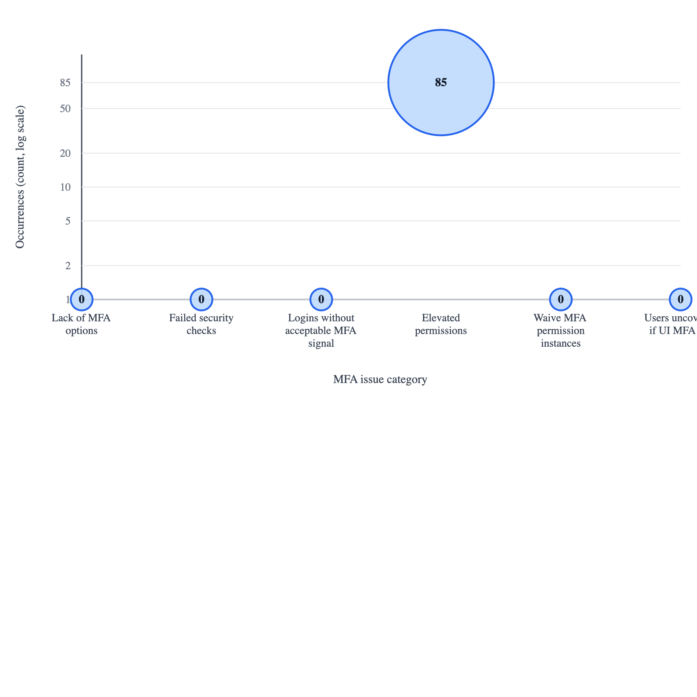

# Salesforce MFA Audit Report
_Run at: 2026-06-26 12:22:55 EDT-0400_

## Executive Summary
> **Overall readiness:** ⚠️ **Needs review**
> **Section score:** 5/6 passing | ⚠️ 1 warning

- **Primary takeaway:** 85 privileged internal user(s) must be ready for phishing-resistant MFA, and 0 bypass assignment(s) were detected.
- **Coverage snapshot:** 250 active internal user(s), 32 user(s) with permission-based UI MFA, 0 user(s) not covered if org-wide UI MFA is off.
- **Per-user MFA methods:** visible for 146 internal user(s).
- **SSO snapshot:** 7 SAML config(s) detected.
- **Sampling note:** User-based counts and user lists in this report are based on the first 250 queried users; displayed user sections are capped to 50 rows.

## Org
- **Alias:** `Disney VX Sandbox`
- **Username:** `rick.rice@disney.salesforce.com.dtcvx.full`
- **Instance:** `https://hulu--full.sandbox.my.salesforce.com`

---

## Issue Scatterplot
> **Section score:** 0/1 passing | ⚠️ 1 warning

Point positions use a log-scaled Y-axis so a very large category does not visually flatten the smaller issue categories. Raw counts are still shown inside each point and in the summary below.

- **Lack of MFA options:** 0 occurrence(s) - Disabled built-in authenticator and hardware key options.
- **Failed security checks:** 0 occurrence(s) - Security-focused audit checks currently failing for this org.
- **Logins without acceptable MFA signal:** 0 occurrence(s) - Recent logins classified weak/none/unrecognized/missing (not standard or phishing-resistant) out of 0 sampled logins.
- **Elevated permissions:** 85 occurrence(s) - Privileged internal users in phishing-resistant MFA scope.
- **Waive MFA permission instances:** 0 occurrence(s) - Users with MFA bypass / waiver assignments.
- **Users uncovered if UI MFA off:** 0 occurrence(s) - Internal users without permission-based MFA coverage if org-wide UI MFA is disabled.

---

## Configurations
> **Section score:** 3/4 passing | ⚠️ 1 warning | ℹ️ 2 info

- **Security settings**
  - ✅ Direct UI MFA required: `True`
  - ✅ Built-in authenticator enabled: `True`
  - ✅ Security key / U2F enabled: `True`
  - ℹ️ Lightning Login enabled: `True`
  - ℹ️ SMS identity enabled: `True`
- **Single sign-on settings**
  - ⚠️ SAML login enabled: `True`
  - ℹ️ Multiple SAML configs enabled: `True`
  - ℹ️ Login with Salesforce credentials disabled: `True`
---

## Checks
> **Section score:** 5/6 passing | ⚠️ 1 warning

- ✅ **PASS**: Require MFA for all direct UI logins [True]
- ✅ **PASS**: Built-in authenticator allowed [True]
- ✅ **PASS**: Physical security key (U2F/WebAuthn) allowed [True]
- ✅ **PASS**: No MFA bypass / waiver assignments detected [0]
- ✅ **PASS**: Privileged users exist and the org allows at least one phishing-resistant MFA method [85]
- ⚠️ **WARN**: SSO is configured; review sampled LoginHistory AMR signals and validate all IdP AMR/ACR responses
---

## SSO Signal History
> **Section score:** 1/1 passing

- LoginHistory rows sampled: 100
- Rows marked as SSO via `AuthenticationServiceId`: 25
- `AuthMethodReference` field available: `True`
- ACR context reference field available: `False`
- Rows with AMR values: 25
- Rows with phishing-resistant matches: 2
- Rows with standard MFA matches: 0
- Rows with weak/no MFA matches: 0

### Observed AMR Codes
- ❔ `[pwd]` observed 23 time(s) -> Unrecognized
- ✅ `swk` observed 2 time(s) -> Phishing-resistant MFA
- ⚠️ `okta_verify` observed 2 time(s) -> Standard MFA

### Recent Rows With SSO Signal Detail
- ❔ `2026-06-26T16:15:17.000+0000` | theshayesultan@gmail.com <theshayesultan@gmail.com.vx> | Browser | AMR: `[pwd]` | ACR: `not available` | Match: Unrecognized
- ❔ `2026-06-26T15:45:49.000+0000` | alaricecv@gmail.com <alaricecv@gmail.com.vx> | Browser | AMR: `[pwd]` | ACR: `not available` | Match: Unrecognized
- ❔ `2026-06-26T15:22:32.000+0000` | XXX <andrew.mackie+6a3d8b22@disneyplustesting.com.vx> | Browser | AMR: `[pwd]` | ACR: `not available` | Match: Unrecognized
- ❔ `2026-06-26T14:34:02.000+0000` | andrew.a.mackie@outlook.com <andrew.a.mackie@outlook.com.vx> | Browser | AMR: `[pwd]` | ACR: `not available` | Match: Unrecognized
- ❔ `2026-06-26T13:59:33.000+0000` | laura.occh@icloud.com <laura.occh@icloud.com.vx> | Browser | AMR: `[pwd]` | ACR: `not available` | Match: Unrecognized
- ❔ `2026-06-26T13:55:59.000+0000` | laura.occh@icloud.com <laura.occh@icloud.com.vx> | Browser | AMR: `[pwd]` | ACR: `not available` | Match: Unrecognized
- ❔ `2026-06-26T13:50:51.000+0000` | staceymurray86@yahoo.com.au <staceymurray86@yahoo.com.au.vx> | Browser | AMR: `[pwd]` | ACR: `not available` | Match: Unrecognized
- ❔ `2026-06-26T13:48:49.000+0000` | staceymurray86@yahoo.com.au <staceymurray86@yahoo.com.au.vx> | Browser | AMR: `[pwd]` | ACR: `not available` | Match: Unrecognized
- ❔ `2026-06-26T13:42:15.000+0000` | mia <mina.ihihi.-nd@disneystreaming.com.vx> | Browser | AMR: `[pwd]` | ACR: `not available` | Match: Unrecognized
- ✅ `2026-06-26T13:06:08.000+0000` | Jessica <jessica.chambers.-nd@disney.com.dtcvx.full> | Browser | AMR: `swk;okta_verify` | ACR: `not available` | Match: Phishing-resistant MFA
- ✅ `2026-06-26T13:06:03.000+0000` | Jessica <jessica.chambers.-nd@disney.com.dtcvx.full> | Browser | AMR: `swk;okta_verify` | ACR: `not available` | Match: Phishing-resistant MFA
- ❔ `2026-06-26T13:02:41.000+0000` | avesemman@gmail.com <avesemman@gmail.com.vx> | Browser | AMR: `[pwd]` | ACR: `not available` | Match: Unrecognized
- ❔ `2026-06-26T12:48:33.000+0000` | vintage_ainrashid@hotmail.com <vintage_ainrashid@hotmail.com.vx> | Browser | AMR: `[pwd]` | ACR: `not available` | Match: Unrecognized
- ❔ `2026-06-26T12:44:28.000+0000` | vintage_ainrashid@hotmail.com <vintage_ainrashid@hotmail.com.vx> | Browser | AMR: `[pwd]` | ACR: `not available` | Match: Unrecognized
- ❔ `2026-06-26T12:42:51.000+0000` | adut.malieth@gmail.com <adut.malieth@gmail.com.vx> | Browser | AMR: `[pwd]` | ACR: `not available` | Match: Unrecognized
- ❔ `2026-06-26T12:14:16.000+0000` | emmykessing2007@gmail.com <emmykessing2007@gmail.com.vx> | Browser | AMR: `[pwd]` | ACR: `not available` | Match: Unrecognized
- ❔ `2026-06-26T12:06:36.000+0000` | camandheidib@gmail.com <camandheidib@gmail.com.vx> | Browser | AMR: `[pwd]` | ACR: `not available` | Match: Unrecognized
- ❔ `2026-06-26T11:57:45.000+0000` | mshumeb@gmail.com <mshumeb@gmail.com.vx> | Browser | AMR: `[pwd]` | ACR: `not available` | Match: Unrecognized
- ❔ `2026-06-26T11:56:24.000+0000` | xilcarswell@gmail.com <xilcarswell@gmail.com.vx> | Browser | AMR: `[pwd]` | ACR: `not available` | Match: Unrecognized
- ❔ `2026-06-26T11:53:02.000+0000` | mshumeb@gmail.com <mshumeb@gmail.com.vx> | Browser | AMR: `[pwd]` | ACR: `not available` | Match: Unrecognized
---

## Non-SSO Verification History
> **Section score:** 1/1 passing

- VerificationHistory rows sampled: 100
- Non-SSO verification rows retained: 99
- Rows with phishing-resistant methods: 32
- Rows with standard MFA methods: 67
- Rows with weak or recovery methods: 0

### Observed Non-SSO MFA Methods
- ⚠️ `SalesforceAuthenticator` (Salesforce Authenticator) observed 35 time(s) -> Standard MFA
- ✅ `BuiltInAuthenticator` (Built-In Authenticator) observed 32 time(s) -> Phishing-resistant MFA
- ⚠️ `LL` (Lightning Login) observed 17 time(s) -> Standard MFA
- ⚠️ `Totp` (One-time password) observed 15 time(s) -> Standard MFA

### Recent Non-SSO Verification Rows
- ⚠️ `2026-06-26T16:00:39.000+0000` | Kameron <kameron@flokconsulting.com.dtcvx.full> | Browser | Method: `SalesforceAuthenticator` | Label: Salesforce Authenticator | Match: Standard MFA
- ⚠️ `2026-06-26T16:00:30.000+0000` | Kameron <kameron@flokconsulting.com.dtcvx.full> | Browser | Method: `SalesforceAuthenticator` | Label: Salesforce Authenticator | Match: Standard MFA
- ⚠️ `2026-06-26T15:46:22.000+0000` | Andrew <andrew@flokconsulting.com.dtcvx.full> | Browser | Method: `Totp` | Label: One-time password | Match: Standard MFA
- ⚠️ `2026-06-26T15:46:11.000+0000` | Andrew <andrew@flokconsulting.com.dtcvx.full> | Browser | Method: `Totp` | Label: One-time password | Match: Standard MFA
- ⚠️ `2026-06-26T15:44:24.000+0000` | Alfred <alfred@sarkisconsult.com.dtcvx.full> | Browser | Method: `Totp` | Label: One-time password | Match: Standard MFA
- ⚠️ `2026-06-26T15:44:14.000+0000` | Lindsay <lindsay@disney.com.full> | Browser | Method: `SalesforceAuthenticator` | Label: Salesforce Authenticator | Match: Standard MFA
- ⚠️ `2026-06-26T15:44:06.000+0000` | Lindsay <lindsay@disney.com.full> | Browser | Method: `SalesforceAuthenticator` | Label: Salesforce Authenticator | Match: Standard MFA
- ⚠️ `2026-06-26T15:44:06.000+0000` | Alfred <alfred@sarkisconsult.com.dtcvx.full> | Browser | Method: `Totp` | Label: One-time password | Match: Standard MFA
- ⚠️ `2026-06-26T14:56:17.000+0000` | Jet <jet.le.-nd@disney.com> | Browser | Method: `LL` | Label: Lightning Login | Match: Standard MFA
- ⚠️ `2026-06-26T14:56:09.000+0000` | Jet <jet.le.-nd@disney.com> | Browser | Method: `LL` | Label: Lightning Login | Match: Standard MFA
- ✅ `2026-06-26T14:09:54.000+0000` | Brad <brad@flokconsulting.com.dtcvx.full> | Browser | Method: `BuiltInAuthenticator` | Label: Built-In Authenticator | Match: Phishing-resistant MFA
- ✅ `2026-06-26T14:09:45.000+0000` | Brad <brad@flokconsulting.com.dtcvx.full> | Browser | Method: `BuiltInAuthenticator` | Label: Built-In Authenticator | Match: Phishing-resistant MFA
- ✅ `2026-06-26T13:57:11.000+0000` | Anthony <anthony@flok.io.dtcvx.full> | Browser | Method: `BuiltInAuthenticator` | Label: Built-In Authenticator | Match: Phishing-resistant MFA
- ✅ `2026-06-26T13:56:59.000+0000` | Anthony <anthony@flok.io.dtcvx.full> | Browser | Method: `BuiltInAuthenticator` | Label: Built-In Authenticator | Match: Phishing-resistant MFA
- ✅ `2026-06-26T13:38:43.000+0000` | Anthony <anthony@flok.io.dtcvx.full> | Browser | Method: `BuiltInAuthenticator` | Label: Built-In Authenticator | Match: Phishing-resistant MFA
- ✅ `2026-06-26T13:38:33.000+0000` | Anthony <anthony@flok.io.dtcvx.full> | Browser | Method: `BuiltInAuthenticator` | Label: Built-In Authenticator | Match: Phishing-resistant MFA
- ⚠️ `2026-06-26T04:44:20.000+0000` | Andrew <andrew@flokconsulting.com.dtcvx.full> | Browser | Method: `Totp` | Label: One-time password | Match: Standard MFA
- ⚠️ `2026-06-26T04:44:07.000+0000` | Andrew <andrew@flokconsulting.com.dtcvx.full> | Browser | Method: `Totp` | Label: One-time password | Match: Standard MFA
- ⚠️ `2026-06-25T20:43:30.000+0000` | Jet <jet.le.-nd@disney.com> | Browser | Method: `LL` | Label: Lightning Login | Match: Standard MFA
- ⚠️ `2026-06-25T20:43:23.000+0000` | Jet <jet.le.-nd@disney.com> | Browser | Method: `LL` | Label: Lightning Login | Match: Standard MFA
---

## User Summary
> **Section score:** 2/3 passing | ⚠️ 1 warning | ℹ️ 1 info

- Active internal users: 250
- Privileged internal users: 85
- Users with bypass assignments: 0
- Users with permission-based UI MFA: 32
- SAML SSO configs: 7
- Users with visible MFA method detail: 146
---

## Users
> **Section score:** 2/3 passing | ⚠️ 1 warning

### Privileged Users
- **Training** `<trainingknowledgeintegration@hulu.com.full>`
  - Available MFA methods: Email OTP
  - Profile permission: Modify All Data
  - Profile permission: View All Data
- **Jeff** `<jeff@flok.io.dtcvx.full>`
  - Available MFA methods: Salesforce Authenticator, Email OTP
  - Profile: System Administrator
  - Profile permission: Modify All Data
  - Profile permission: View All Data
  - Profile permission: Customize Application
  - Profile permission: Author Apex
- **Integration** `<integration@00ddh000003poegeam.com>`
  - Available MFA methods: none visible
  - Profile permission: View All Data
- **Insights** `<insightsintegration@00ddh000003poegeam.ext>`
  - Available MFA methods: none visible
  - Profile permission: View All Data
- **Dan** `<dhalpin@rightpoint.com.dtcvx.full>`
  - Available MFA methods: Salesforce Authenticator, Email OTP, SMS / mobile OTP
  - Profile: System Administrator
  - Profile permission: Modify All Data
  - Profile permission: View All Data
  - Profile permission: Customize Application
  - Profile permission: Author Apex
- **Akhil** `<akhilnair@rightpoint.com.dtcvx.full>`
  - Available MFA methods: Email OTP
  - Profile: System Administrator
  - Profile permission: Modify All Data
  - Profile permission: View All Data
  - Profile permission: Customize Application
  - Profile permission: Author Apex
- **GenAI** `<genaiintegration@hulu.com.full>`
  - Available MFA methods: none visible
  - Profile permission: Modify All Data
  - Profile permission: View All Data
  - Profile permission: Customize Application
  - Profile permission: Author Apex
- **Sourabh** `<sourabhgoyal+hulu@rightpoint.com.full>`
  - Available MFA methods: Email OTP
  - Profile: System Administrator
  - Profile permission: Modify All Data
  - Profile permission: View All Data
  - Profile permission: Customize Application
  - Profile permission: Author Apex
- **Jet** `<jet.le.-nd@disney.com>`
  - Available MFA methods: Salesforce Authenticator, Email OTP
  - Profile: System Administrator
  - Profile permission: Modify All Data
  - Profile permission: View All Data
  - Profile permission: Customize Application
  - Profile permission: Author Apex
- **Alex** `<alexandra.sturgess@disney.com.dtcvx.full>`
  - Available MFA methods: SMS / mobile OTP
  - Profile: System Administrator
  - Profile permission: Modify All Data
  - Profile permission: View All Data
  - Profile permission: Customize Application
  - Profile permission: Author Apex
- **Dawn** `<dawn.cadwell@disney.com.dtcvx.full>`
  - Available MFA methods: Email OTP
  - Profile: System Administrator
  - Profile permission: Modify All Data
  - Profile permission: View All Data
  - Profile permission: Customize Application
  - Profile permission: Author Apex
- **Nick** `<nick.berg@disney.com.dtcvx.full>`
  - Available MFA methods: Email OTP
  - Profile: System Administrator
  - Profile permission: Modify All Data
  - Profile permission: View All Data
  - Profile permission: Customize Application
  - Profile permission: Author Apex
- **Andy** `<andy.vazquez@disney.com.dtcvx.full>`
  - Available MFA methods: none visible
  - Profile: System Administrator
  - Profile permission: Modify All Data
  - Profile permission: View All Data
  - Profile permission: Customize Application
  - Profile permission: Author Apex
- **Michael** `<michael.mandujano@disney.com.dtcvx.full>`
  - Available MFA methods: none visible
  - Profile: System Administrator
  - Profile permission: Modify All Data
  - Profile permission: View All Data
  - Profile permission: Customize Application
  - Profile permission: Author Apex
- **Jincky** `<jincky.sales@disney.com.dtcvx.full>`
  - Available MFA methods: Email OTP
  - Profile: System Administrator
  - Profile permission: Modify All Data
  - Profile permission: View All Data
  - Profile permission: Customize Application
  - Profile permission: Author Apex
- **Stephanie** `<stephanie.luzi@disney.com.dtcvx.full>`
  - Available MFA methods: none visible
  - Permission set 'Manage Users': Customize Application
- **CCPA** `<ccpaintegration@hulu.com.full>`
  - Available MFA methods: Email OTP
  - Profile permission: Modify All Data
  - Profile permission: View All Data
  - Profile permission: Customize Application
  - Profile permission: Author Apex
- **Horven** `<horven.tsai@disney.com.dtcvx.full>`
  - Available MFA methods: Salesforce Authenticator, Email OTP, SMS / mobile OTP
  - Profile: System Administrator
  - Profile permission: Modify All Data
  - Profile permission: View All Data
  - Profile permission: Customize Application
  - Profile permission: Author Apex
  - Permission set 'sf_devops_InitializeEnvironments': Customize Application
  - Permission set 'Data Cloud Architect': Customize Application
- **Support** `<csi-all@disneystreaming.com.full>`
  - Available MFA methods: Email OTP
  - Profile: System Administrator
  - Profile permission: Modify All Data
  - Profile permission: View All Data
  - Profile permission: Customize Application
  - Profile permission: Author Apex
- **Flanders** `<flandersintegration@hulu.com.full>`
  - Available MFA methods: Email OTP
  - Profile permission: Modify All Data
  - Profile permission: View All Data
  - Profile permission: Customize Application
  - Profile permission: Author Apex
- **ServiceNow** `<servicenow@hulu.com.full>`
  - Available MFA methods: Email OTP
  - Profile permission: Modify All Data
  - Profile permission: View All Data
- **Mulesoft** `<mulesoft@hulu.com.full>`
  - Available MFA methods: Email OTP
  - Profile permission: Modify All Data
  - Profile permission: View All Data
  - Permission set 'Data Cloud Architect': Customize Application
- **Ryan** `<ryan@flokconsulting.com.full>`
  - Available MFA methods: OTP app (TOTP), Email OTP, SMS / mobile OTP
  - Profile: System Administrator
  - Profile permission: Modify All Data
  - Profile permission: View All Data
  - Profile permission: Customize Application
  - Profile permission: Author Apex
- **Salesforce** `<salesforceintegration@salesforce-hulu.com.full>`
  - Available MFA methods: Email OTP
  - Profile permission: View All Data
- **Katie** `<katie.lockwood@disney.com.dtcvx.full>`
  - Available MFA methods: Salesforce Authenticator, Email OTP
  - Profile: System Administrator
  - Profile permission: Modify All Data
  - Profile permission: View All Data
  - Profile permission: Customize Application
  - Profile permission: Author Apex
  - Permission set 'Manage Users': Customize Application
- **Integration** `<integrationuser@hulu.com.full>`
  - Available MFA methods: Email OTP
  - Profile: System Administrator
  - Profile permission: Modify All Data
  - Profile permission: View All Data
  - Profile permission: Customize Application
  - Profile permission: Author Apex
- **jira** `<jira@hulu.com.full>`
  - Available MFA methods: Email OTP
  - Profile permission: Modify All Data
  - Profile permission: View All Data
  - Profile permission: Customize Application
  - Profile permission: Author Apex
- **Automated** `<santoshi@hulu.com.full>`
  - Available MFA methods: Email OTP
  - Profile: System Administrator
  - Profile permission: Modify All Data
  - Profile permission: View All Data
  - Profile permission: Customize Application
  - Profile permission: Author Apex
- **Drew** `<dbenson@flokconsulting.com.dtcvx.full>`
  - Available MFA methods: Email OTP, SMS / mobile OTP
  - Profile: System Administrator
  - Profile permission: Modify All Data
  - Profile permission: View All Data
  - Profile permission: Customize Application
  - Profile permission: Author Apex
  - Permission set 'Query All Files Permission': View All Data
- **Data** `<datasubjectaccessrequest@hulu.com.full>`
  - Available MFA methods: Email OTP
  - Profile permission: Modify All Data
  - Profile permission: View All Data
- **Data** `<dmed_datagovernanceaccess@disneystreaming.com.full>`
  - Available MFA methods: Email OTP
  - Profile permission: Modify All Data
  - Profile permission: View All Data
- **David** `<davidw@flokconsulting.com.dtcvx.full>`
  - Available MFA methods: Built-in authenticator, Email OTP, SMS / mobile OTP
  - Profile: System Administrator
  - Profile permission: Modify All Data
  - Profile permission: View All Data
  - Profile permission: Customize Application
  - Profile permission: Author Apex
- **Brad** `<brad@flokconsulting.com.dtcvx.full>`
  - Available MFA methods: Built-in authenticator, Email OTP
  - Profile: System Administrator
  - Profile permission: Modify All Data
  - Profile permission: View All Data
  - Profile permission: Customize Application
  - Profile permission: Author Apex
  - Permission set 'Data Cloud Architect': Customize Application
- **Kameron** `<kameron@flokconsulting.com.dtcvx.full>`
  - Available MFA methods: Salesforce Authenticator, Email OTP
  - Profile: System Administrator
  - Profile permission: Modify All Data
  - Profile permission: View All Data
  - Profile permission: Customize Application
  - Profile permission: Author Apex
- **Paul** `<pkreis+hulu@rightpoint.com.full>`
  - Available MFA methods: Email OTP
  - Profile: System Administrator
  - Profile permission: Modify All Data
  - Profile permission: View All Data
  - Profile permission: Customize Application
  - Profile permission: Author Apex
- **Vijay** `<vijay.gopalabhatla@disney.com.dtcvx.full>`
  - Available MFA methods: Email OTP
  - Profile: System Administrator
  - Profile permission: Modify All Data
  - Profile permission: View All Data
  - Profile permission: Customize Application
  - Profile permission: Author Apex
  - Permission set 'Data Cloud Architect': Customize Application
- **Jen** `<jen@flokconsulting.com.dtcvx.full>`
  - Available MFA methods: Built-in authenticator, Salesforce Authenticator, Email OTP
  - Profile: System Administrator
  - Profile permission: Modify All Data
  - Profile permission: View All Data
  - Profile permission: Customize Application
  - Profile permission: Author Apex
  - Permission set 'Data Cloud Architect': Customize Application
- **Andrew** `<andrew@flokconsulting.com.dtcvx.full>`
  - Available MFA methods: OTP app (TOTP), Email OTP
  - Profile: System Administrator
  - Profile permission: Modify All Data
  - Profile permission: View All Data
  - Profile permission: Customize Application
  - Profile permission: Author Apex
  - Permission set 'Data Cloud Architect': Customize Application
- **Alfred** `<alfred@sarkisconsult.com.dtcvx.full>`
  - Available MFA methods: OTP app (TOTP), Email OTP
  - Profile: System Administrator
  - Profile permission: Modify All Data
  - Profile permission: View All Data
  - Profile permission: Customize Application
  - Profile permission: Author Apex
- **Own** `<ownbackup@integration.disneystreaming.com.dtcvx.full>`
  - Available MFA methods: Email OTP
  - Profile: System Administrator
  - Profile permission: Modify All Data
  - Profile permission: View All Data
  - Profile permission: Customize Application
  - Profile permission: Author Apex
- **Splunk** `<splunk-vx-sfdc@integration.disney.com.dtcvx.full>`
  - Available MFA methods: Email OTP
  - Permission set 'View All Data': View All Data
- **Gary** `<gary@flok.io.disneyprod.full>`
  - Available MFA methods: Salesforce Authenticator, Email OTP
  - Profile: System Administrator
  - Profile permission: Modify All Data
  - Profile permission: View All Data
  - Profile permission: Customize Application
  - Profile permission: Author Apex
- **Tim** `<tim@flok.io.dtcvx.full>`
  - Available MFA methods: Salesforce Authenticator, Email OTP
  - Profile: System Administrator
  - Profile permission: Modify All Data
  - Profile permission: View All Data
  - Profile permission: Customize Application
  - Profile permission: Author Apex
- **Rick** `<rick.rice@disney.salesforce.com.dtcvx.full>`
  - Available MFA methods: Salesforce Authenticator, Email OTP
  - Profile: System Administrator
  - Profile permission: Modify All Data
  - Profile permission: View All Data
  - Profile permission: Customize Application
  - Profile permission: Author Apex
  - Permission set 'Shield App': Modify All Data, View All Data
  - Permission set 'Threat Detection App': View All Data
- **Aleksandr** `<aleksandr.lisenko@disney.com>`
  - Available MFA methods: none visible
  - Permission set 'Setup Read-Only': View All Data
- **Cristhian** `<cristhian.soria.lopez@disney.com>`
  - Available MFA methods: none visible
  - Permission set 'Setup Read-Only': View All Data
- **Mariusz** `<mariusz.kremer@disney.com>`
  - Available MFA methods: none visible
  - Permission set 'Setup Read-Only': View All Data
- **Graeme** `<graeme.funk.-nd@disney.com>`
  - Available MFA methods: none visible
  - Permission set 'Setup Read-Only': View All Data
- **Ovi** `<ovi.comes.-nd@disney.com>`
  - Available MFA methods: none visible
  - Permission set 'Setup Read-Only': View All Data
- **Kevin** `<kevin.chan@disney.com.dtcvx.full>`
  - Available MFA methods: Salesforce Authenticator, Email OTP
  - Profile: System Administrator
  - Profile permission: Modify All Data
  - Profile permission: View All Data
  - Profile permission: Customize Application
  - Profile permission: Author Apex
---

## Manual Review
> **Section score:** 0/2 passing | ⚠️ 2 warning

- SSO MFA / phishing-resistant claim validation: The report now samples recent LoginHistory AMR values, but you should still validate every SSO path and full IdP assertion behavior, especially where ACR is not exposed in LoginHistory.
- Actual user MFA method enrollment: The standard sf CLI surfaces org settings and permission assignments cleanly, but user-level registered MFA methods are not consistently queryable through stable CLI-accessible objects.
---

## Resolutions
> **Section score:** 0/1 passing | ⚠️ 1 warning

Suggested primary and secondary fixes for the issues flagged in the executive summary.

- ⚠️ **SSO is configured; review sampled LoginHistory AMR signals and validate all IdP AMR/ACR responses**
  - **Primary:** Configure your identity provider to enforce phishing-resistant MFA and return the corresponding AMR/ACR values (for example phr/phrh or FIDO2/WebAuthn), then confirm LoginHistory AMR signals reflect strong methods across every SSO login path.
  - **Secondary:** For any SSO path that cannot return phishing-resistant signals, enable Salesforce-side MFA as a backstop and monitor LoginHistory for weak or missing AMR signals.